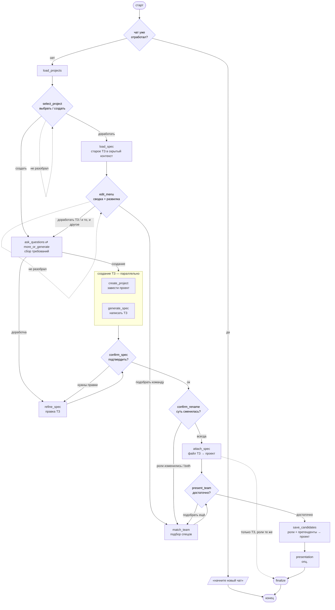

# Accelerator Customer Agent

ИИ-ассистент заказчика для акселератора: собирает требования в диалоге, заводит
проект, пишет ТЗ, подбирает команду, при необходимости готовит презентацию.
На LangGraph — граф с паузами (`interrupt`) под общение с заказчиком.

---

## Что делает



\* Подбор при доработке запускается для «Подобрать команду» и «И то, и другое»
всегда, а для «Доработать ТЗ» — только если правки **изменили состав ролей**.
Иначе после `attach_spec` граф идёт сразу в финал, команду не трогая.

### Ключевые решения

| Решение | Как сделано |
|---|---|
| **Токен заказчика** | В `Context` (configurable), **не в state** — state уходит в чекпоинт. Обновляется на каждый run. |
| **Только свои проекты** | `GET /api/customer/projects` — бэк сам фильтрует по владельцу из JWT. |
| **Не утомлять вопросами** | Максимум 3 вопроса за ход. Как только собран минимум — предлагаем «давайте я сам напишу ТЗ». |
| **Два генератора ТЗ** | `creative` (мало инфы → ИИ достраивает, придуманное → в `assumptions`) и `strict` (много инфы → ничего не выдумывает). Выбор по `coverage`. |
| **Правка ТЗ** | Старое ТЗ скачивается в **скрытый контекст** — в чате его не видно, ИИ просто «уже знаком» с проектом. Правка точечная + `change_summary`. |
| **Развилка доработки** | `edit_menu` показывает краткую детерминированную сводку проекта и спрашивает: править ТЗ / подбирать команду / и то, и другое. |
| **Переподбор по ролям** | При «Доработать ТЗ» refine возвращает `roles_changed`; команду пересматриваем только если состав ролей поменялся. |
| **Переименование проекта** | Если правки сменили суть, refine предлагает `proposed_title`; `confirm_rename` спрашивает и переименовывает при согласии (PATCH `title`). |
| **Подбор команды** | Без векторной базы: LLM мапит роли на справочники → `GET /public/interns/v2`. На маршруте «только команда» роли берутся из состава проекта, а если он пуст — извлекаются из текста ТЗ. |
| **Запись в проект** | После подтверждения подборки в проект пишутся: **состав специалистов** (`required_specialists` из ролей → чипы и `specialists_count`) и **претенденты** (`POST /candidates`, статус POTENTIAL). Роли — первыми, затем претендентов. |
| **«Подобрать ещё»** | `exclude_ids` из state (`candidate_ids`) — кто уже в списке, не повторяем. |
| **Конец чата** | После `finalize` любое новое сообщение → детерминированный ответ «заведите новый чат». |
| **Презентация** | `off` / `local` (python-pptx) / `gamma` (Gamma API). Включается `PRESENTATION_PROVIDER`. |

---

## Интеграция с API акселератора

Класс `src/api/client.py:AcceleratorAPI` — строго существующие ручки:

| Метод | Ручка |
|---|---|
| `get_my_projects_flat()` | `GET /api/customer/projects` |
| `list_my_projects()` | `GET /api/customer/projects/v2` |
| `create_project()` | `POST /api/customer/create-project` |
| `update_project()` | `PATCH /api/customer/{id}` (описание, название, `required_specialists`, файлы) |
| `upload_project_file()` | `POST /api/customer/upload-project-file` |
| `attach_file_to_project()` | upload → PATCH `files[]` (два шага) |
| `add_candidates()` | `POST /api/projects/{id}/candidates` — претенденты (POTENTIAL) |
| `list_project_invitations()` | `GET /api/projects/{id}/invitations` — для сводки проекта |
| `search_interns()` | `GET /api/public/interns/v2` |
| `get_intern()` | `GET /api/public/interns/{id}` |
| `list_professions()` / `list_stacks()` | `GET /api/public/professions` / `/stacks` |
| `download_file()` | скачивание ТЗ по `file_url` (кеш; вся ФС — в отдельном потоке) |

**Закрыто на клиенте** (ручки не эмулируем):
- `exclude_for_project_id` у `/interns/v2` → исключаем уже показанных на клиенте;
- `/specialists/facets` → используем `/professions` + `/stacks`.

---

## Запуск (uv)

Проект на **uv**.

```bash
uv sync --extra dev          # окружение + dev-инструменты (pytest, ruff, mypy)

cp .env.example .env
# заполнить: LLM_BASE_URL, LLM_API_KEY, LLM_MODEL,
#            API_BASE_URL, DEV_USER_TOKEN (JWT заказчика для локальной отладки),
#            LANGSMITH_API_KEY (по желанию — трейсинг)

uv run langgraph dev --no-reload
```

`--no-reload` важен: `langgraph dev` держит состояние прерванного прогона
**в памяти**, а авто-reload при изменении файлов это состояние стирает — пауза
«повисает» в Studio. Для стабильной локальной работы reload отключаем.

Короткие обёртки — в `Makefile`:

```bash
make install     # uv sync --extra dev
make dev         # uv run langgraph dev   (для отладки пауз добавляй --no-reload)
make test        # uv run pytest -q
make lint        # uv run ruff check src tests
make compile     # быстрая проверка, что граф собирается
```

Studio откроется само. Граф — `customer_agent`.

### Токен в Studio

Токен живёт в **context**, не в state. Панель **Configurable**:

```json
{ "user_token": "<JWT заказчика>", "api_base_url": "http://localhost:8000" }
```

Для быстрой отладки можно прописать `DEV_USER_TOKEN` в `.env` — узлы возьмут его,
если в context токена нет.

### Первый запуск

Input — пустой (`{}`) или с первым сообщением:

```json
{ "messages": [{ "role": "user", "content": "хочу сделать маркетплейс" }] }
```

Граф сам сходит за проектами и встанет на паузу с выбором.

### Ответы на паузы

Граф встаёт на `interrupt` (payload: `kind`, `message`, `choices`/`data`).
Ответ — `Command(resume=...)`; в Studio вводится значение:

```json
{ "id": 42 }        // выбрал проект
{ "id": "new" }     // новый проект
{ "id": "spec" }    // развилка доработки: spec | team | both
{ "text": "оплата картой, каталог книг" }   // ответ на вопросы
{ "id": "generate" }  // «составьте ТЗ сами»
{ "id": "ok" }        // подтвердил ТЗ
{ "id": "yes" }       // согласие переименовать проект
{ "id": "more" }      // подобрать ещё
{ "id": "done" }      // подборки достаточно
```

### Типы пауз (контракт с фронтом)

| `kind` | Когда | `choices` / `data` |
|---|---|---|
| `select_project` | старт | `choices`: `new` + проекты заказчика |
| `edit_intent` | доработка проекта | `choices`: `spec` / `team` / `both`; `data.summary` — сводка проекта |
| `ask_questions` | сбор требований | `data.questions[]` (`id`, `text`, `hint`) |
| `more_or_generate` | минимум собран | `choices`: `generate` / `more`; `data.missing_topics` |
| `confirm_spec` | ТЗ готово | `choices`: `ok` / `edit`; `data`: ТЗ, `assumptions`, `changes`, `roles_needed` |
| `confirm_rename` | правки сменили суть | `choices`: `yes` / `no` (новое название — в тексте) |
| `team_ready` | команда подобрана | `choices`: `done` / `more`; `data.team` |

---

## Тесты

Детерминированные, без сети и LLM: маршруты графа, сборка сводки проекта,
построение HTTP-запросов клиента (через `httpx.MockTransport`), гард на отсутствие
блокирующей ФС в async `download_file`.

```bash
make test          # или: uv run pytest -q
```

Файлы — в `tests/` (`test_routers.py`, `test_summary.py`, `test_client.py`,
фикстуры в `conftest.py`).

---

## Прод

```bash
langgraph build -t accelerator_agent
langgraph up --wait          # LangGraph Server + Postgres + Redis
```

Наружу LangGraph Server **не выставлять** — только через свой FastAPI-шлюз
(валидирует заказчика и прокидывает JWT в `context` на каждый run).

---

## Структура

```
src/
├── core/config.py            # pydantic-settings (.env)
├── utils/llm_gen.py          # ChatOpenAI + прокси + ретраи + семафор
├── api/
│   ├── client.py             # AcceleratorAPI — методы над ручками акселератора
│   ├── documents.py          # извлечение текста ТЗ (md / docx / pdf)
│   └── errors.py
├── requirements_flow/        # сбор требований (вопросы + оценка достаточности)
├── techspec/
│   ├── card.py               # карточка проекта (название + описание) до ТЗ
│   ├── service.py            # generate / refine ТЗ + извлечение ролей из ТЗ
│   ├── prompts.py  models.py
│   └── render.py             # markdown → docx
├── team/                     # подбор команды (роли → справочники → кандидаты)
│   ├── service.py  directory.py  prompts.py  models.py
├── presentation/             # презентация (off / local / gamma)
└── graph/
    ├── state.py              # AgentState + Context (токен здесь, не в state)
    ├── interrupts.py         # виды пауз (KIND_*), payload, разбор ответов
    ├── progress.py           # прогресс в стрим для фронта
    ├── nodes.py              # узлы графа
    └── graph.py              # сборка графа + условные рёбра
```